# 基于springboot的中小型医院网站

#### 介绍

中小型医院网站基于 SpringBoot 框架开发，旨在为医院提供一个高效、便捷、一体化的信息管理和服务平台，以提升医院的运营效率和服务质量，满足管理端、医师端和用户端的不同需求。

#### 技术栈

后端技术栈：Springboot+Mysql+Maven

前端技术栈：Vue+Html+Css+Javascript+ElementUI

开发工具：Idea+Vscode+Navicate

#### 系统功能介绍

（一）管理端  
个人中心    
  管理端人员可以查看和修改个人信息，如联系方式、登录密码等。  
  接收系统重要通知和任务提醒。  
用户管理    
查看用户的详细信息，包括基本资料、就诊记录等。  
对用户进行分类管理，如普通患者、VIP 患者等。  
处理用户的注册申请和信息变更。  
医师管理  
录入医师的个人信息、专业资质、工作经历等。  
安排医师的排班和工作任务。  
对医师的绩效进行评估和管理。  
关于我们管理  
编辑医院的介绍、发展历程、宗旨和愿景等信息。  
展示医院的荣誉和资质证书。  
科室类型管理  
新增、修改和删除科室类型，如内科、外科、妇产科等。  
为每个科室设置相关的介绍和诊疗范围。  
门诊信息管理  
发布门诊的时间安排、就诊流程、注意事项等信息。  
管理门诊的预约和挂号情况。  
药库信息管理  
录入药品的基本信息，包括名称、规格、库存数量等。  
监控药品的出入库情况，及时进行补货和盘点。  
缴费清单管理  
查看患者的缴费记录和明细。  
处理缴费异常和退费申请。  
药品类型管理  
定义药品的分类，如处方药、非处方药、中成药等。  
为不同类型的药品设置相应的管理规则。  
系统管理  
进行系统的参数设置，如数据备份频率、权限分配等。  
监控系统的运行状态，及时处理故障和异常。  
（二）医师端  
个人中心  
医师可以更新个人的专业信息、擅长领域等。  
查看工作安排和待办事项。  
用户管理  
查看所负责患者的基本信息和病历资料。  
跟踪患者的治疗进展和康复情况。  
医师管理  
与其他医师进行交流和协作。  
查看同科室或相关科室医师的信息。  
关于我们管理  
了解医院的最新动态和发展规划。  
科室类型管理  
为所属科室提交改进建议和需求。  
门诊信息管理  
查看自己的门诊排班和患者预约情况。  
记录门诊患者的诊断和治疗方案。  
药库信息管理  
为患者开具药品处方，查看药品库存。  
提出药品采购需求。  
缴费清单管理  
确认患者的缴费情况。  
药品类型管理  
了解各类药品的使用规范和注意事项。  
系统管理  
反馈系统使用过程中的问题和建议。  
（三）用户端  
门诊信息  
查看医院各科室的门诊时间和专家排班。  
在线预约门诊，选择就诊时间和医师。  
药库信息  
了解医院药库的药品目录和库存情况。  
系统公告  
接收医院发布的重要通知、优惠活动等信息。  
个人中心  
完善个人健康资料和就诊信息。  
查看自己的预约记录和就诊历史。  
后台管理  
预约挂号管理  
取消或修改已预约的门诊。  
体检报告管理  
查看个人的体检报告和解读。  
医师开药管理  
查看医师为自己开具的处方。  
用户取药管理  
确认取药状态和相关信息。  
缴费清单管理  
查看就诊的费用明细和支付情况。  

#### 系统作用

提升医院管理效率  
集中化的管理功能，使医院的资源配置、人员安排和信息管理更加科学和高效。  
自动化的流程处理，减少了繁琐的人工操作和数据重复录入，降低了错误率。  
提高医疗服务质量  
医师能够更方便地获取患者信息和医疗资源，为患者提供更精准的诊断和治疗。  
用户可以便捷地获取医院信息和服务，提升了就医体验和满意度。  
增强信息透明度  
公开的门诊信息、药库信息和系统公告，使用户能够更好地了解医院的运作和服务内容。  
缴费清单的清晰展示，保障了患者的知情权和消费权益。  
促进医疗资源优化配置  
通过对门诊、药库等信息的有效管理，医院能够更合理地调配资源，提高资源利用率。  

#### 系统功能截图

代码结构

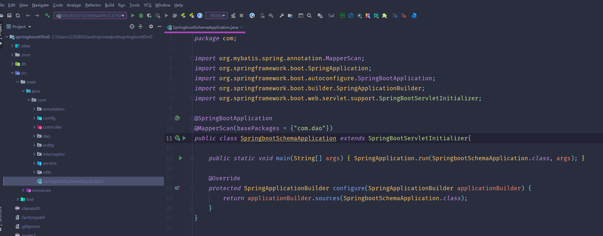

数据库表

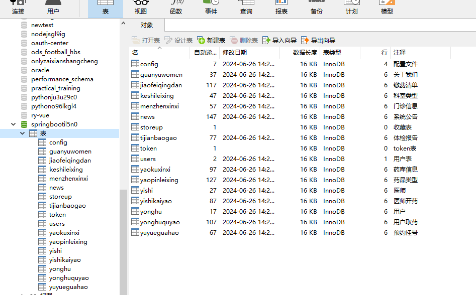

登录

门诊信息

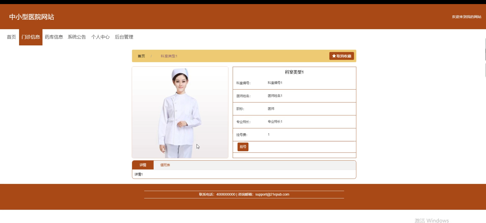

药库信息

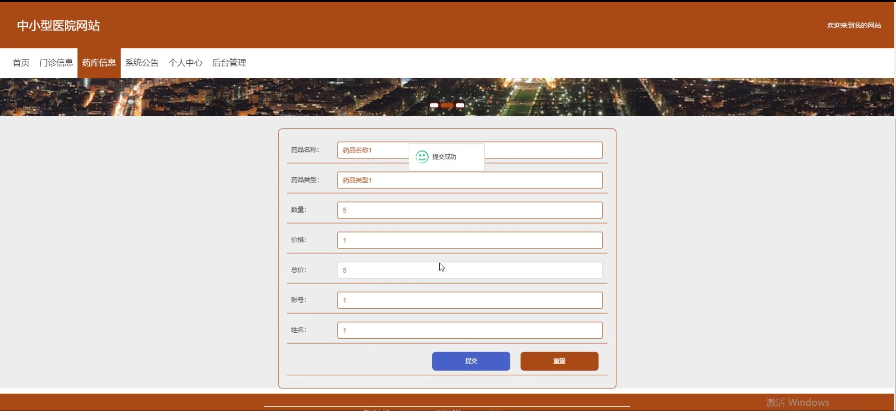

系统公告

个人中心

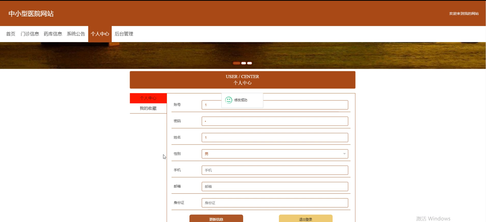

用户端后台管理

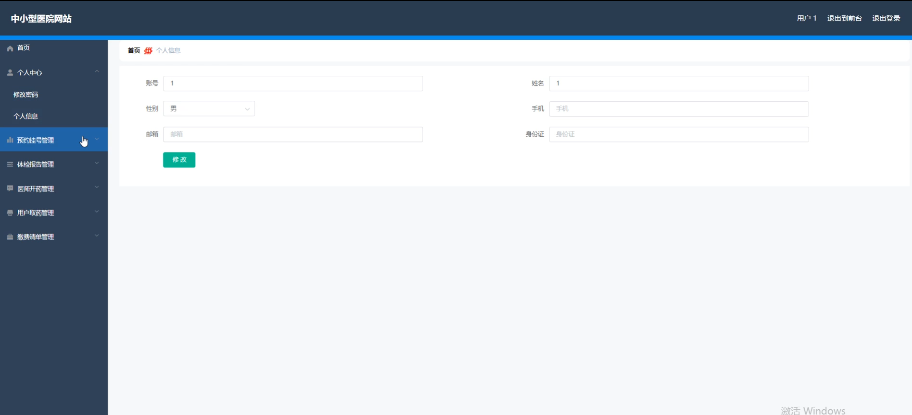

预约挂号管理

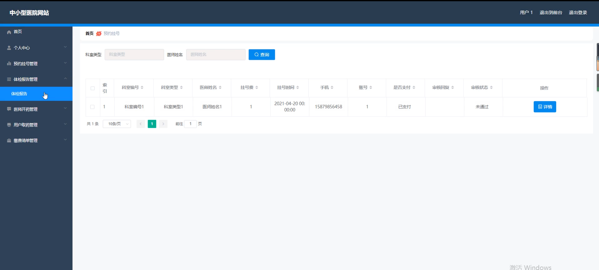

用户取药管理

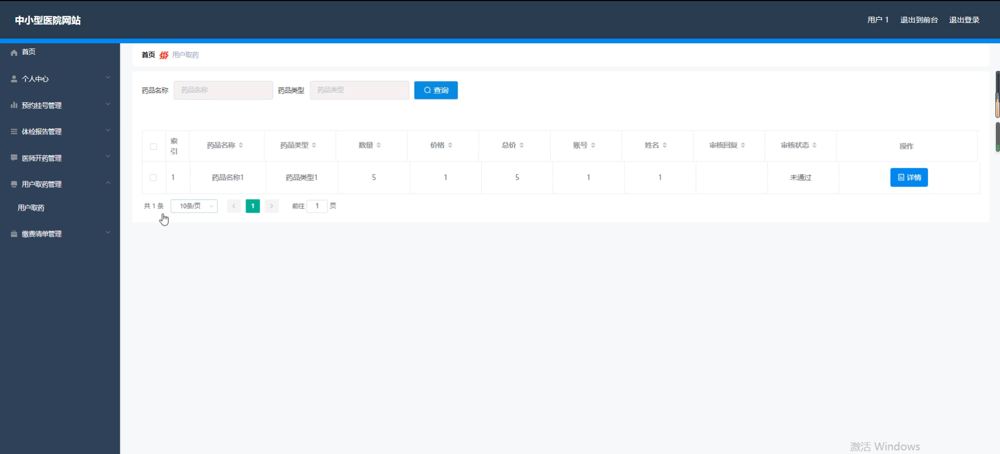

管理员端首页

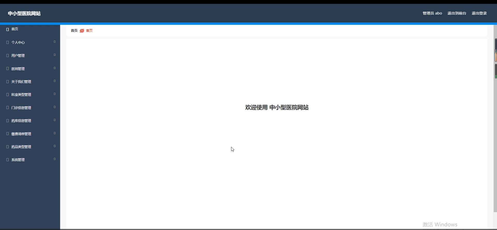

用户管理

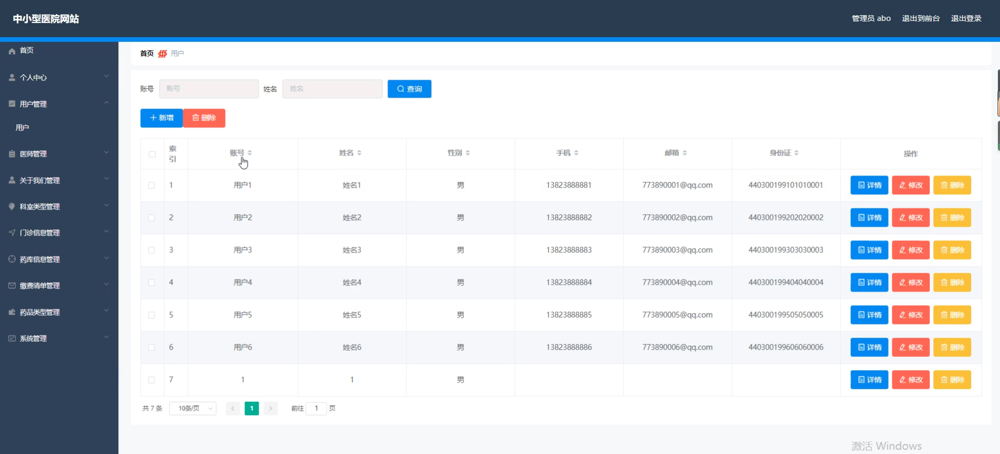

医师管理

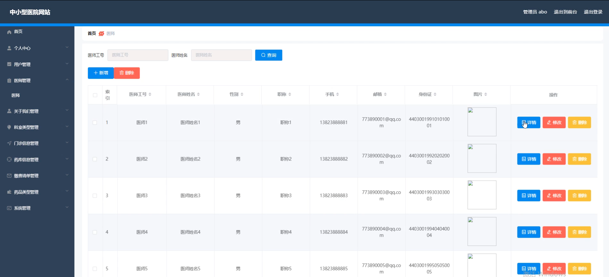

医师端后台管理

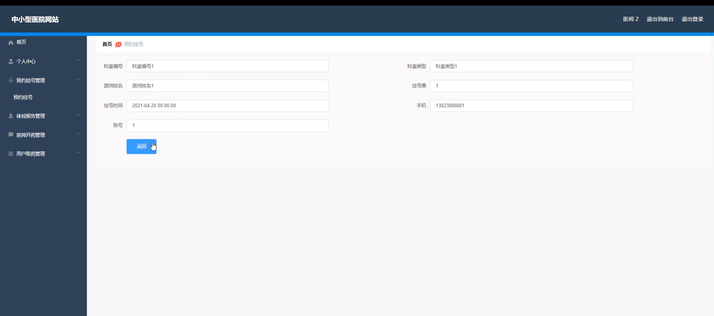

体检报告

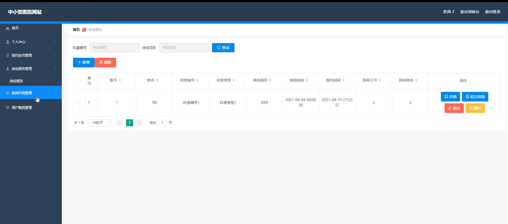

#### 总结

本基于 SpringBoot 的中小型医院网站，通过合理的角色划分和丰富的功能模块，实现了医院管理的信息化、规范化和智能化。为管理端提供了全面的管控手段，为医师端提供了便捷的工作支持，为用户端提供了优质的服务体验，有助于提升医院的整体竞争力和社会形象，推动医疗服务的持续发展和创新。

#### 使用说明

创建数据库，执行数据库脚本 修改jdbc数据库连接参数 下载安装maven依赖jar 启动idea中的springboot项目

后台地址：http://localhost:8080/springbootil5n0/admin/dist/index.html

管理员  abo 密码 abo

前台地址：http://localhost:8080/springbootil5n0/front/index.html
